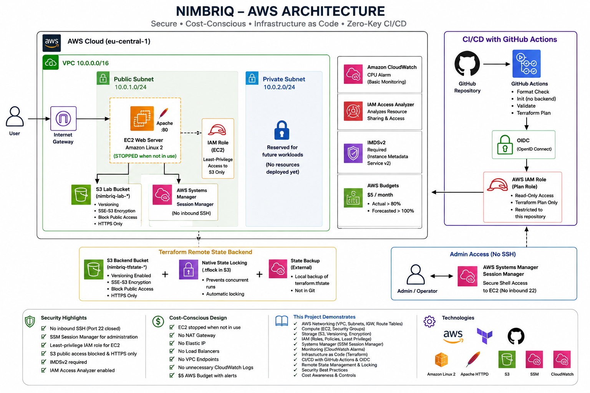

# Nimbriq

**Nimbriq** is a hands-on AWS cloud and DevOps project designed to demonstrate practical skills in cloud networking, Infrastructure as Code, configuration management, IAM, security hardening, CI/CD, remote state management, monitoring, and cost-conscious AWS architecture.

The project was built incrementally: first by understanding and deploying AWS resources manually, then importing and managing the infrastructure with Terraform, and finally adding Ansible configuration management, GitHub Actions automation, security hardening, and operational controls.

**Primary AWS Region:** `eu-central-1` (Frankfurt)

## Project Status

**Core implementation complete  active learning and portfolio project.**

The current implementation includes Terraform-managed AWS infrastructure, Ansible configuration management over AWS Systems Manager, secure remote Terraform state, GitHub OIDC authentication, and automated Terraform and Ansible validation.

The project remains intentionally extensible for future cloud and DevOps improvements.

---

## Architecture

Nimbriq currently includes:

- Custom VPC with public and private subnets
- Internet Gateway and dedicated route tables
- Amazon Linux EC2 web server running Apache
- Terraform-managed AWS infrastructure
- Ansible-managed EC2 web-server configuration
- AWS Systems Manager Session Manager for administration and Ansible connectivity
- Dedicated private S3 transfer bucket for Ansible over SSM
- S3 application storage with encryption and versioning
- IAM role-based EC2 access to S3
- CloudWatch monitoring
- IAM Access Analyzer
- Terraform remote state stored securely in S3
- GitHub Actions for Terraform CI, Terraform Plan, and Ansible CI
- GitHub Actions authenticated to AWS through OIDC

The private subnet is currently reserved for future workloads.

---

## What This Project Demonstrates

### AWS

- VPC networking
- Public and private subnets
- Internet Gateway
- Route tables and subnet associations
- Amazon EC2
- Amazon EBS
- Amazon S3
- IAM roles and policies
- AWS Systems Manager
- Amazon CloudWatch
- IAM Access Analyzer
- AWS Budgets

### Terraform

- Infrastructure as Code
- Variables and outputs
- Input validation
- Terraform modules
- Resource imports
- State management
- Remote S3 backend
- Native S3 state locking
- Drift detection
- Resource dependency management
- Safe plan/apply workflows

### DevOps

- Git and GitHub
- GitHub Actions
- Terraform CI validation
- Automated Terraform Plan
- Ansible configuration management
- Ansible roles, templates, variables, and handlers
- Idempotent server configuration
- Ansible connectivity through AWS Systems Manager
- Ansible CI inventory and syntax validation
- GitHub-to-AWS OIDC authentication
- CI without permanent AWS access keys

### Security

- Least-privilege IAM
- No inbound SSH
- AWS Systems Manager Session Manager
- IMDSv2 enforcement
- S3 Block Public Access
- S3 encryption
- HTTPS-only S3 bucket policies
- IAM Access Analyzer
- Restricted GitHub Actions IAM role
- No permanent AWS access keys stored in GitHub

---

## Network Architecture

The VPC uses the following address space:

| Component | CIDR |
| --- | --- |
| VPC | `10.0.0.0/16` |
| Public Subnet | `10.0.1.0/24` |
| Private Subnet | `10.0.2.0/24` |

The public subnet currently contains the EC2 web server.

The private subnet is intentionally reserved for future workloads without introducing a NAT Gateway at the current stage of the project.

---

## Compute

The web server uses:

- Amazon Linux
- EC2 `t3.micro`
- Apache HTTP Server
- HTTP port `80`
- IMDSv2 required
- EBS gp3 root volume

The instance is stopped when it is not required for testing or demonstrations.

Administrative access does not require inbound SSH.

---

## Secure Administration with AWS SSM

SSH access on port `22` was removed after AWS Systems Manager Session Manager was successfully configured and tested.

Administration now follows this model:

~~~text
Administrator
     |
     v
AWS IAM Authentication
     |
     v
AWS Systems Manager
     |
     v
Session Manager
     |
     v
EC2 Instance
~~~

This removes the need to expose an SSH management port to the internet.

---

## Configuration Management with Ansible

Terraform provisions the AWS infrastructure, while Ansible manages operating-system and web-server configuration on the EC2 instance.

Ansible connects through AWS Systems Manager using the `amazon.aws.aws_ssm` connection plugin rather than SSH.

~~~text
Ansible Controller
       |
       v
AWS Authentication
       |
       v
AWS Systems Manager
       |
       +---- Temporary module transfer ----> S3 Transfer Bucket
       |
       v
EC2 Instance
       |
       v
Apache Configuration
~~~

A dedicated private S3 bucket is used for temporary Ansible module transfer. It uses S3 Block Public Access, SSE-S3 encryption, bucket-owner-enforced ownership, no versioning, a one-day lifecycle policy, and HTTPS-only access.

The `webserver` role:

- Ensures Apache (`httpd`) is installed
- Ensures Apache is enabled and running
- Deploys the Nimbriq page from a Jinja2 template
- Restarts Apache through a handler only when required

The configuration was tested for idempotency. After reaching the desired state, a second playbook run completed with `changed=0`.

---
## Storage

The project contains an S3 lab bucket configured with:

- Versioning
- SSE-S3 encryption
- Block Public Access
- Bucket Owner Enforced ownership
- HTTPS-only bucket policy
- No public access

EC2 accesses the bucket through an IAM instance role rather than embedded AWS credentials.

---

## IAM and Least Privilege

The EC2 instance uses a dedicated IAM role and instance profile.

Its custom S3 policy permits only the required operations, including:

- List bucket
- List bucket versions
- Get objects
- Get object versions
- Put objects

Object deletion is intentionally not granted.

The EC2 role also uses `AmazonSSMManagedInstanceCore` so the server can be administered through AWS Systems Manager.

---

## Monitoring

Nimbriq currently includes:

- CloudWatch CPU utilization alarm
- IAM Access Analyzer

Detailed monitoring and unnecessary log ingestion were deliberately avoided to keep the lab simple and cost-conscious.

---

## Terraform Architecture

Terraform is organized into four logical modules:

~~~text
terraform/
|
|-- backend.tf
|-- cloudwatch.tf
|-- compute.tf
|-- moved.tf
|-- network.tf
|-- outputs.tf
|-- provider.tf
|-- security.tf
|-- storage.tf
|-- terraform.tfvars.example
|-- variables.tf
|-- versions.tf
|
`-- modules/
    |-- network/
    |   |-- main.tf
    |   |-- variables.tf
    |   `-- outputs.tf
    |
    |-- compute/
    |   |-- main.tf
    |   |-- variables.tf
    |   |-- outputs.tf
    |
    |-- storage/
    |   |-- main.tf
    |   |-- variables.tf
    |   `-- outputs.tf
    |
    `-- security/
        |-- main.tf
        |-- variables.tf
        `-- outputs.tf
~~~

The modules separate networking, compute, storage, and security responsibilities while keeping the project small enough to understand easily.

---

## Terraform Remote State

Terraform state is stored in a dedicated S3 backend rather than committed to Git.

The backend uses:

- S3 remote state
- S3 bucket versioning
- SSE-S3 encryption
- Block Public Access
- HTTPS-only access
- Native Terraform S3 state locking using `.tflock`

The backend bucket is bootstrapped separately from the application infrastructure.

Terraform state files and local variable files are excluded from Git.

---

## CI/CD with GitHub Actions

Nimbriq contains three GitHub Actions workflows.

### Terraform CI

The Terraform CI workflow performs:

~~~text
terraform fmt -check
terraform init -backend=false
terraform validate
~~~

This workflow validates Terraform code without requiring AWS credentials.

### Terraform Plan

The Terraform Plan workflow authenticates to AWS through GitHub OIDC and performs:

~~~text
GitHub Actions
       |
       v
GitHub OIDC
       |
       v
AWS IAM Plan Role
       |
       v
Terraform Init
       |
       v
Terraform Validate
       |
       v
Terraform Plan
~~~

No permanent AWS access keys are stored in GitHub.

Terraform Apply is intentionally not automated.

### Ansible CI

The Ansible CI workflow performs offline validation:

~~~text
Checkout Repository
       |
       v
Install Ansible
       |
       v
Validate Inventory
       |
       v
Syntax Check Playbooks
~~~

It does not start EC2 instances, connect to AWS, or apply configuration changes.

---
## Cost-Conscious Design

This project intentionally avoids unnecessary AWS services that could create recurring costs.

Current design decisions include:

- EC2 stopped when not being used
- No NAT Gateway
- No Elastic IP
- No load balancer
- No interface VPC endpoints
- No custom CloudTrail trail
- No unnecessary CloudWatch log groups
- No detailed EC2 monitoring

A monthly AWS Budget is also configured as an additional safety mechanism.

~~~text
Monthly budget: $5 USD

Actual spend > 80%      -> Alert
Forecasted spend > 100% -> Alert
~~~

The budget provides notifications only and does not automatically stop AWS resources.

---

## Repository Structure

~~~text
nimbriq/
|
|-- .github/
|   `-- workflows/
|       |-- ansible-ci.yml
|       |-- terraform-ci.yml
|       `-- terraform-plan.yml
|
|-- ansible/
|   |-- inventory/
|   |-- playbooks/
|   |-- roles/
|   `-- ansible.cfg
|
|-- docs/
|   `-- nimbriq-architecture.png
|
|-- terraform/
|   |-- modules/
|   |-- backend.tf
|   |-- cloudwatch.tf
|   |-- compute.tf
|   |-- moved.tf
|   |-- network.tf
|   |-- outputs.tf
|   |-- provider.tf
|   |-- security.tf
|   |-- storage.tf
|   |-- terraform.tfvars.example
|   |-- variables.tf
|   `-- versions.tf
|
|-- .gitattributes
|-- .gitignore
`-- README.md
~~~

Local `.terraform/`, Terraform state files, credentials, and `terraform.tfvars` are intentionally excluded from the repository.

---

## Basic Terraform Workflow

### Prerequisites

- AWS CLI
- Terraform
- AWS account
- Valid AWS credentials
- Access to the configured Terraform backend

Typical workflow:

~~~powershell
terraform -chdir=terraform init
terraform -chdir=terraform fmt -check -recursive
terraform -chdir=terraform validate
terraform -chdir=terraform plan
~~~

Always review the Terraform plan carefully before applying infrastructure changes.

---

## Project Evolution

Nimbriq was developed incrementally to demonstrate the infrastructure lifecycle:

~~~text
AWS Fundamentals
      |
      v
Manual Infrastructure Deployment
      |
      v
Terraform Import
      |
      v
Remote State Management
      |
      v
Variables and Outputs
      |
      v
Terraform Modules
      |
      v
Reproducibility Testing
      |
      v
GitHub Actions CI
      |
      v
AWS OIDC Authentication
      |
      v
SSM Security Hardening
      |
      v
Ansible Configuration Management
      |
      v
Ansible over AWS SSM
      |
      v
Ansible CI and Idempotency Validation
      |
      v
Terraform / Ansible Responsibility Separation
      |
      v
Cost and Operational Hardening
~~~

This approach demonstrates not only how infrastructure is created, but also how existing infrastructure can be safely migrated into Infrastructure as Code.

---

## Future Improvements

Possible future additions include:

- HTTPS and TLS termination
- Application Load Balancer
- Private application workloads
- Additional Terraform testing
- Ansible linting and role testing
- Policy-as-Code validation
- Separate development and production environments
- Controlled/manual Terraform Apply workflow
- Controlled/manual Ansible deployment workflow

These services are intentionally not deployed yet because the current project prioritizes learning, security, simplicity, and cost control.

---

## Project Purpose

Nimbriq is an educational and portfolio project created to demonstrate hands-on experience with:

**AWS | Terraform | Ansible | Infrastructure as Code | Configuration Management | Cloud Security | IAM | Networking | GitHub Actions | OIDC | DevOps | Systems Manager | S3 | EC2**

The project focuses not only on deploying AWS infrastructure, but also on understanding why each component exists, how it is secured, how it is automated, and how unnecessary cloud costs can be avoided.
